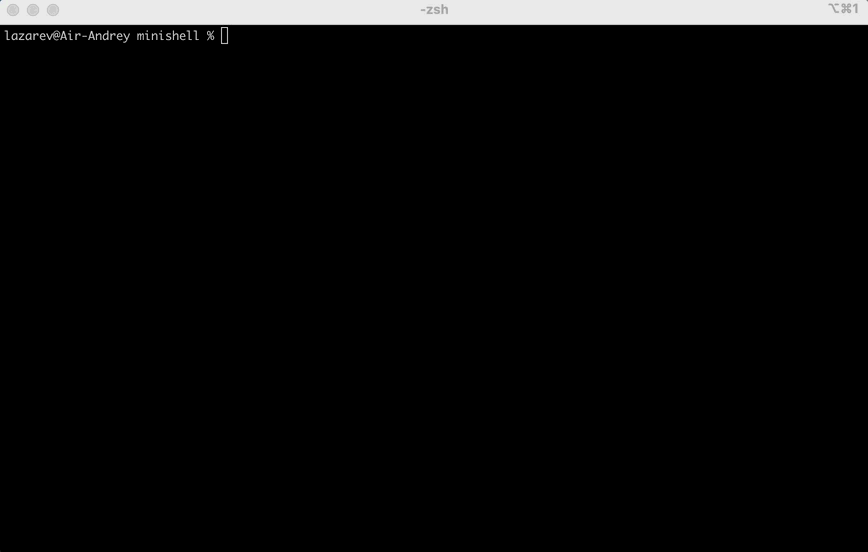

# Проект "Minishell"
[](https://forthebadge.com)
[](https://forthebadge.com)
[](https://forthebadge.com)

### Описание проекта
В рамках представленного проекта "Minishell" была разработана собственная версия командной оболочки Unix shell на языке программирования C.
Целью данного проекта является детальное изучение работы ядра системы Unix и важной его составляющей - создания и синхронизации процессов.

Итоговая терминальная программа способна анализировать полученные команды (с помощью парсинга входных данных), запускать исполняемые файлы (как с аргументами, так и без них) и выполнять некоторые собственные builtin функции.
В свою очередь, выполнение команды внутри разработанной оболочки подразумевает создание нового процесса, состояние которого отслеживается непосредственно его родительским процессом.

### Демонстрация


### Запуск
```bash
git clone https://github.com/Dronoti/minishell.git minishell && cd minishell && make && make clean && ./minishell
```

### Функциональность
Программа поддерживает такие встроенные функции как `echo`, `cd`, `pwd`, `export`, `unset`, `env`, `exit`, а также работу с редиректами, пайпами, сигналами, переменными окружения и т.д.

Подробная функциональность программы, ограничения и требования к ее реализации описаны в [задании.](./minishell.pdf)